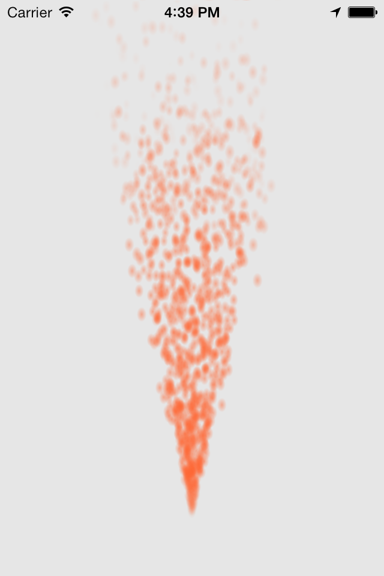
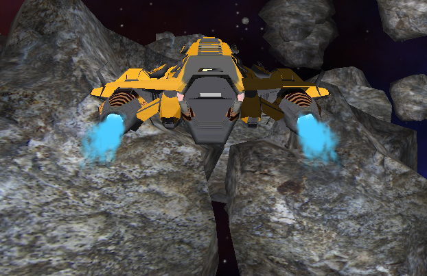

SRParticleSystem
===================

A lightning-fast particle system for OpenGL ES on iOS. Primitives are generated only once on the CPU, and particle positions are calculated in the vertex shader.

Currently only supports constant-color particles.

## Screenshots

## Perfomance

The iPhone 5 can handle >40000 tiny particles at 60 fps. In most cases, performance appears to be fill-rate-limited, meaning the number of particles you can draw is limited not by geometry calculations, but by the speed the hardware can fill pixels--and there's no way to optimize around that besides making particles smaller (reducing the number of pixels that must be filled per particle). The vertex-processing stages (which only become a bottleneck when you're drawing tens of thousands of tiny particles) could probably be optimized by using OpenGL ES 3.0 instancing and transform feedback (which is only available on the iPhone 5s/iPad Air generation), but that's not the bottleneck in normal use.
